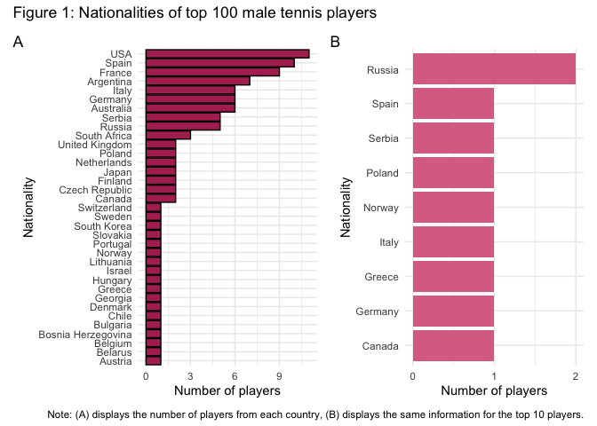
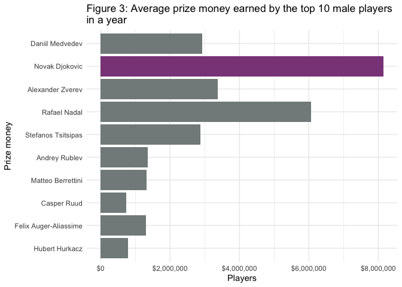
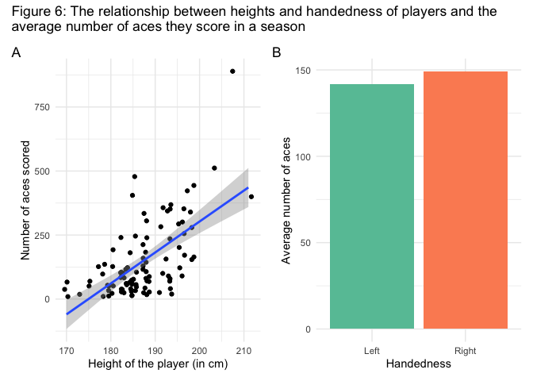
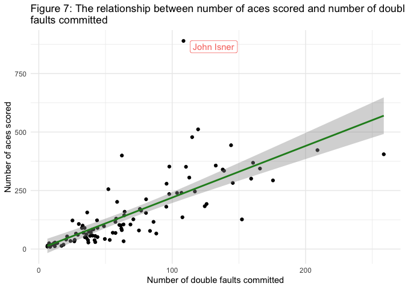

Tennis Players
================
Zeynep Aslan

- [World’s Top 100 Male Tennis
  Players](#worlds-top-100-male-tennis-players)
  - [1. Nationality of the players](#1-nationality-of-the-players)
  - [2. Age of the players](#2-age-of-the-players)
  - [3. Prize money earned](#3-prize-money-earned)
  - [4. Heights of the players](#4-heights-of-the-players)
  - [5. Handedness of the players](#5-handedness-of-the-players)
  - [6. Statistics](#6-statistics)
    - [Aces](#aces)
    - [Service and Return Points Won](#service-and-return-points-won)
  - [7. Models](#7-models)
    - [Basic Linear Regression Model](#basic-linear-regression-model)
    - [Decision Tree Model](#decision-tree-model)
    - [Best Model](#best-model)

<!-- IMPORTANT: To be able to reproduce this report, you need the tennis_players.csv data. Use data.scraping.R file to generate this data before trying to reproduce this report
-->

# World’s Top 100 Male Tennis Players

This report analyses the biographic information and statistics of
world’s top 100 male tennis players. Rankings are based on the scoring
criteria determined by the **[Association of Tennis Professionals
(ATP)](https://www.atptour.com/en/rankings/singles)** for *singles*.

## 1. Nationality of the players

First, let’s check the nationalities of the top 100 male players to see
how many players there are from each country. Figure 1A shows that the
USA has the most players, followed by Spain and France. However,
interestingly, when we look at the top 10 players in the world, we see
that none of them are from the USA. Instead, Russia has the most players
in the top 10 list, as no country other than Russia has more than 1
player on the list.

<!-- -->

## 2. Age of the players

Next, we will look at the age information of the top 100 male tennis
players.

<table>
<caption>
Table 1: Age descriptives
</caption>
<thead>
<tr>
<th style="text-align:right;">
Mean
</th>
<th style="text-align:right;">
Min
</th>
<th style="text-align:right;">
Max
</th>
</tr>
</thead>
<tbody>
<tr>
<td style="text-align:right;">
29.97
</td>
<td style="text-align:right;">
21
</td>
<td style="text-align:right;">
43
</td>
</tr>
</tbody>
</table>

Table 1 shows that the mean age of the players is 29.97 and the range is
21 to 43. Considering that these are top 100 players of the world and
therefore, are pretty advanced in their careers, it is not surprising
that the mean age is not very low. By the same logic, we would expect
older players to have more titles. Figure 2 below demonstrates this
relationship. Specifically, in Figure 2A, we see a slightly positive
relationship between age of the players and number of titles earned,
confirming our intuition. However, this relationship is heavily
influenced by the data points of four players (*Roger Federer, Rafael
Nadal, Novak Djokovic and Andy Murray*), who have significantly more
titles than players their own age. Thus, in Figure 2B, we visualized the
same relationship by removing these extreme cases. There is a positive
relationship between age and number of titles earned even without these
influential data points.

<!-- -->

## 3. Prize money earned

Figure 3 demonstrates the average prize money earned by the top 10
players in a year. As can be seen from the graph **Novak Djokovic**
earns by far the most money in a season. His closest follower, **Rafael
Nadal** earns approximately \$2 million less than him.

<!-- -->

## 4. Heights of the players

Figure 4 displays the distribution of the heights of the top 100 male
tennis players. Looking at the distribution, it is fair to conclude that
(successful) tennis players tend to be tall. The mean height of the top
100 players is 187.14cm, which is shown with the dotted line on the
graph below.

    ## Warning: Using `size` aesthetic for lines was deprecated in ggplot2 3.4.0.
    ## ℹ Please use `linewidth` instead.
    ## This warning is displayed once every 8 hours.
    ## Call `lifecycle::last_lifecycle_warnings()` to see where this warning was
    ## generated.

<!-- -->

## 5. Handedness of the players

Figure 5 displays the handedness information of the top 100 tennis
players. Like most people, the majority of tennis players are
right-handed. Specifically, as pie chart also demonstrates, 75% of the
top 100 tennis players are right-handed.

<!-- -->

## 6. Statistics

### Aces

Figure 6 investigates if there is a relationship between players’
heights and handedness and the approximate number of
[aces](https://tenniscompanion.org/ace/) they score in a season. As can
be seen in Figure 6A, there seems to be a positive relationship between
heights of the players and the number of aces they score in a year.
Handedness, on the other hand, does not seem to affect the effectiveness
of the services as both right and left-handed players seem to score
similar number of aces in a year.

<!-- -->

Figure 7, on the other hand, demonstrates the relationship between
number of aces scored and number of [double
faults](https://www.rookieroad.com/tennis/what-is-double-fault/)
committed by a player. This relationship is interesting to look at
because in order to score an ace, players tend to go for riskier
services which increases their chances to commit a double fault. Figure
7 indeed shows this relationship; as the number of aces increases,
number of double faults also increases. There is one significant outlier
in the data though, i.e., John Isner - he scores significantly more aces
than he commits double faults compared to the other top 100 players.

<!-- -->

### Service and Return Points Won

Finally, Figure 8 shows the relationship between percentage of service
points and return points won for the top 10 players. From the graph, we
see a consistent pattern - It seems that all 10 players are more
successful in winning the games that they serve, suggesting that
starting the game by serving gives the players an advantage.

<!-- -->

## 7. Models

Lastly, we estimated two models to predict the titles earned by the
players in a year as a function of total aces they scored in a year and
total service points won.

### Basic Linear Regression Model

<table>
<caption>
Table 2: Basic Linear Regression Model (10 folds)
</caption>
<thead>
<tr>
<th style="text-align:center;">
Metric
</th>
<th style="text-align:center;">
Estimator
</th>
<th style="text-align:center;">
Mean
</th>
<th style="text-align:center;">
n
</th>
<th style="text-align:center;">
Standard Error
</th>
</tr>
</thead>
<tbody>
<tr>
<td style="text-align:center;">
rmse
</td>
<td style="text-align:center;">
standard
</td>
<td style="text-align:center;">
0.62
</td>
<td style="text-align:center;">
10
</td>
<td style="text-align:center;">
0.15
</td>
</tr>
</tbody>
</table>

Table 2 shows the output of the basic linear regression model. The basic
linear regression model estimated using 10-folds cross-validation
predicted the number of titles earned with a RMSE of 0.62, meaning that
the model’s predictions were wrong by approximately 0.62 titles.

### Decision Tree Model

<table>
<caption>
Table 3: Decision Tree Model (10 folds)
</caption>
<thead>
<tr>
<th style="text-align:center;">
Metric
</th>
<th style="text-align:center;">
Estimator
</th>
<th style="text-align:center;">
Mean
</th>
<th style="text-align:center;">
n
</th>
<th style="text-align:center;">
Standard Error
</th>
</tr>
</thead>
<tbody>
<tr>
<td style="text-align:center;">
rmse
</td>
<td style="text-align:center;">
standard
</td>
<td style="text-align:center;">
0.6
</td>
<td style="text-align:center;">
10
</td>
<td style="text-align:center;">
0.12
</td>
</tr>
</tbody>
</table>

Table 3 shows the output of the decision tree model. The decision tree
model estimated using 10-folds cross-validation predicted the number of
titles earned with a RMSE of 0.6, meaning that the model’s predictions
were wrong by approximately 0.6 titles.

As can be seen from the Table 2 and Table 3 above, decision tree model
performs slightly better than the linear regression model. Therefore,
decision tree model will be used to predict the held-out test set of
data using the full training set

### Best Model

<table>
<caption>
Table 4: Decision Tree Model
</caption>
<thead>
<tr>
<th style="text-align:center;">
Metric
</th>
<th style="text-align:center;">
Estimator
</th>
<th style="text-align:center;">
Estimate
</th>
</tr>
</thead>
<tbody>
<tr>
<td style="text-align:center;">
rmse
</td>
<td style="text-align:center;">
standard
</td>
<td style="text-align:center;">
0.88
</td>
</tr>
</tbody>
</table>

The decision tree model estimated using the full training set predicted
the titles earned per year in the held-out test set with a RMSE of 0.88
titles, which is not so great considering that the range of titles
earned is between 0 to 4. However, we should also keep in mind that
**the amount of data is low and therefore, might not be enough to
accurately estimate these models.**
